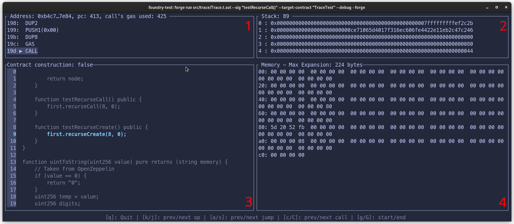

## Debugger

Forge ships with an interactive debugger.

Currently, the debugger is only accessible on `forge run`. To run the debugger, run:

```sh
$ forge run --debug $FILE --sig $FUNC
```

Where `$FILE` is the path to the contract you want to debug, and `$FUNC` is the signature of the function you want to debug. For example:

```sh
$ forge run --debug src/MyContract.sol --sig "someFunction()"
```

If your source file contains more than one contract, specify the contract you want to debug using the `--target-contract` flag.

### Debugger layout



When the debugger is run, you are presented with a terminal divided into four quadrants:

- **Quadrant 1**: The opcodes in the debugging session, with the current opcode highlighted. Additionally, the address of the current account, the program counter and the accumulated gas usage is also displayed
- **Quadrant 2**: The current stack, as well as the size of the stack
- **Quadrant 3**: The source view
- **Quadrant 4**: The current memory of the EVM

### Navigating

- <kbd>q</kbd>: Quit the debugger
- <kbd>n + k</kbd>: Step `n` times backwards (alternatively scroll up with your mouse)
- <kbd>n + j</kbd>: Step `n` times forwards (alternatively scroll down with your mouse)
- <kbd>g</kbd>: Move to the beginning of the transaction
- <kbd>G</kbd>: Move to the end of the transaction
- <kbd>c</kbd>: Move to the previous call-type instruction (i.e. [`CALL`][op-call], [`STATICCALL`][op-staticcall], [`DELEGATECALL`][op-delegatecall], and [`CALLCODE`][op-callcode]).
- <kbd>C</kbd>: Move to the next call-type instruction
- <kbd>a</kbd>: Move to the previous [`JUMP`][op-jump] or [`JUMPI`][op-jumpi] instruction
- <kbd>s</kbd>: Move to the next [`JUMPDEST`][op-jumpdest] instruction

[op-call]: https://www.evm.codes/#f1
[op-staticcall]: https://www.evm.codes/#fa
[op-delegatecall]: https://www.evm.codes/#f4
[op-callcode]: https://www.evm.codes/#f2
[op-jumpdest]: https://www.evm.codes/#5b
[op-jump]: https://www.evm.codes/#f1
[op-jumpi]: https://www.evm.codes/#57
